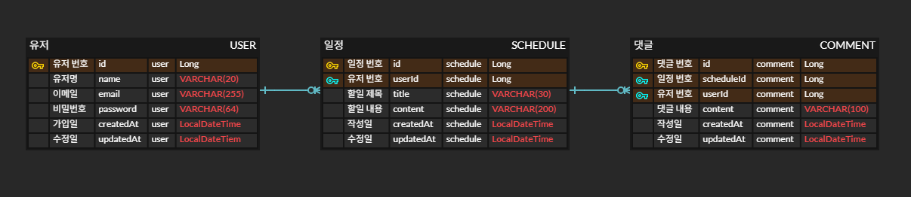

# 일정 관리 시스템 (My Scheduler V2)

> **Spring Boot와 JPA를 활용하여 유저 관리, 일정 관리, 댓글 기능을 제공하는 RESTful 서버입니다.**
> 본 프로젝트는 **Cookie & Session** 기반의 인증 방식을 채택하여 보안성을 강화했습니다.

---

## 1. 프로젝트 개요
- **설명**: 회원가입 및 로그인을 통해 개인별 일정을 관리하고 일정에 댓글을 달 수 있는 커뮤니티형 일정 관리 서비스입니다.
- **핵심 가치**: 세션을 통한 사용자 인증, 데이터 간의 연관 관계(유저-일정-댓글) 설계, 그리고 JPA Auditing을 통한 데이터 이력 관리.

---

## 2. 기술 스택
| 분류 | 기술               |
| :--- |:-----------------|
| **Language** | Java 17          |
| **Framework** | Spring Boot 3.x  |
| **Database** | MySQL            |
| **ORM** | Spring Data JPA  |
| **Auth** | Cookie & Session |
| **API Test** | Postman          |

---

## 3. ERD와 API 명세서

<details>
<summary><strong>ERD</strong></summary>


</details>

<details>
<summary><strong> API 명세서 공통 가이드</strong></summary>

본 프로젝트의 모든 API는 일관된 응답 규격과 예외 처리 방식을 따릅니다.

### 1. 공통 응답 구조 (CommonApiResponse)
모든 성공 및 실패 응답은 아래 `CommonApiResponse<T>` 구조를 따릅니다.

```json
{
  "message": "응답 메시지",
  "data": null // 또는 실제 반환 데이터
}
```

### 2. 전역 예외 처리 (Global Exception Handling)
비즈니스 로직 수행 중 발생하는 예외는 `ServiceException`을 통해 관리되며 `GlobalExceptionHandler`에 의해 일관된 JSON 형태로 변환되어 클라이언트에 전달됩니다.

**비즈니스 에러 코드 정의 (`ErrorCode`)**

| 코드 | HTTP 상태 | 메시지 | 설명 |
|:---|:---|:---|:---|
| `VALIDATION_FAILED` | 400 | 입력값이 올바르지 않습니다. | 유효성 검사 실패 (@Valid) |
| `UNAUTHORIZED` | 401 | 로그인이 필요합니다. | 인증되지 않은 사용자의 접근 |
| `INVALID_PASSWORD` | 401 | 비밀번호가 올바르지 않습니다. | 로그인 시 비밀번호 불일치 |
| `SCHEDULE_NOT_FOUND` | 404 | 일정이 존재하지 않습니다. | 존재하지 않는 일정 조회/수정/삭제 시 |
| `USER_NOT_FOUND` | 404 | 유저가 존재하지 않습니다. | 존재하지 않는 유저 조회/수정/삭제 시 |
| `COMMENT_NOT_FOUND` | 404 | 댓글이 존재하지 않습니다. | 존재하지 않는 댓글 조회/수정/삭제 시 |
| `EMAIL_DUPLICATE` | 409 | 이미 존재하는 이메일입니다. | 회원가입 시 이메일 중복 |

**예외 응답 예시 (400 Bad Request - 유효성 검사 실패 시)**
```json
{
  "message": "입력값이 올바르지 않습니다.",
  "data": [
    "email: 이메일을 입력해주세요",
    "password: 비밀번호를 입력해주세요"
  ]
}
```

### 3. 인증 및 세션 정책
* **인증 방식**: Cookie & Session
* **세션 식별자**: `JSESSIONID`
* **인증 전용 DTO**: 세션에는 민감 정보(비밀번호 등)를 제외하고 `LoginUserDto(userId, email)`만 저장하여 보안성과 영속성 문제를 해결했습니다.
</details>

<details>
<summary><strong>인증 API 명세서</strong></summary>

인증/인가를 위한 엔드포인트입니다. `HttpSession`을 사용하여 상태를 유지합니다.

### 1. 로그인 (Login)
사용자의 이메일과 비밀번호를 검증하여 세션을 생성합니다.

* **URL**: `POST /api/auth/login`
* **인증 필요**: No

#### Request (LoginRequest)
| 필드 | 타입 | 제약사항 | 설명 |
| :--- | :--- | :--- | :--- |
| `email` | String | `@NotBlank` | 사용자 이메일 |
| `password` | String | `@NotBlank` | 사용자 비밀번호 |

#### Response
* **Success (200 OK)**
  ```json
  {
    "message": "로그인 성공",
    "data": null
  }
  ```
* **Error (400, 401, 404)**
  * `VALIDATION_FAILED`: 이메일 또는 비밀번호 미입력
  * `USER_NOT_FOUND`: 가입되지 않은 이메일
  * `INVALID_PASSWORD`: 비밀번호 불일치

---

### 2. 로그아웃 (Logout)
현재 사용자의 세션을 무효화합니다.

* **URL**: `POST /api/auth/logout`
* **인증 필요**: Yes (세션 쿠키 필요)

#### Response
* **Success (200 OK)**
  ```json
  {
    "message": "로그아웃 성공",
    "data": null
  }
  ```

---

### 참고: 인증 전용 DTO
보안상 `User` 엔티티 대신 `LoginUserDto`를 세션에 저장합니다.
* **저장 데이터**: `userId` (Long), `email` (String)
</details>

<details>
<summary><strong>유저 API 명세서</strong></summary>

유저의 생성(회원가입), 조회, 수정, 탈퇴 기능을 관리하는 엔드포인트입니다.

### 1. 회원가입 (Sign-up)
사용자 계정을 생성합니다.

* **URL**: `POST /api/users`
* **Response 예시 (201 Created)**
  ```json
  {
    "message": "회원 가입에 성공했습니다.",
    "data": {
      "id": 1,
      "name": "홍길동",
      "email": "test@example.com",
      "createdAt": "2026-04-20T11:00:00",
      "updatedAt": "2026-04-20T11:00:00"
    }
  }
  ```

### 2. 전체 유저 조회 (Get Users)
* **URL**: `GET /api/users`
* **Response 예시 (200 OK)**
  ```json
  {
    "message": "전체 조회에 성공했습니다.",
    "data": [
      {
        "id": 1,
        "name": "홍길동",
        "email": "test@example.com",
        "createdAt": "2026-04-20T11:00:00",
        "updatedAt": "2026-04-20T11:00:00"
      }
    ]
  }
  ```

### 3. 내 프로필 조회 (Get My Info)
* **URL**: `GET /api/users/me`
* **Response 예시 (200 OK)**
  ```json
  {
    "message": "프로필 조회에 성공했습니다.",
    "data": {
      "id": 1,
      "name": "홍길동",
      "email": "test@example.com",
      "createdAt": "2026-04-20T11:00:00",
      "updatedAt": "2026-04-20T11:00:00"
    }
  }
  ```

### 4. 내 프로필 수정 (Update User)
* **URL**: `PATCH /api/users/me`
* **Response 예시 (200 OK)**
  ```json
  {
    "message": "프로필 정보를 수정했습니다",
    "data": {
      "id": 1,
      "name": "김철수",
      "email": "test@example.com",
      "createdAt": "2026-04-20T11:00:00",
      "updatedAt": "2026-04-20T12:00:00"
    }
  }
  ```

### 5. 회원 탈퇴 (Delete User)
* **URL**: `DELETE /api/users/me`
* **구현 상세**:
  * **Facade**: `UserActionFacade`
  * **관여 서비스**: `UserService`, `ScheduleService` (및 댓글 관련 서비스)
  * **설명**: 퍼사드 계층에서 회원 탈퇴 시 해당 유저의 모든 일정과 관련 데이터(댓글 등)를 연쇄적으로 삭제하는 작업을 총괄합니다.
* **Response 예시 (200 OK)**
  ```json
  {
    "message": "회원 탈퇴했습니다.",
    "data": null
  }
  ```
---

### 기술 노트
* **회원가입 로직**: 본래 `Auth` 도메인에 위치해야 하는 로직이나 현재 프로젝트의 회원가입 절차가 단순하여 비즈니스 복잡도가 낮습니다. 이에 따라 `UserController`의 `UserCreate` 기능을 회원가입(Sign-up) 로직으로 대체하여 구현하였습니다.
* **프로필 관리**: `/me` 경로를 사용하여 로그인한 유저 본인임을 명시하고 `@SessionAttribute`를 통해 안전하게 `userId`를 식별합니다.
</details>

<details>
<summary><strong>일정 API 명세서</strong></summary>

개인별 일정의 생성, 조회, 수정, 삭제 기능을 제공합니다. 모든 조회 및 관리 작업은 로그인한 사용자의 세션 정보(`userId`)를 기준으로 안전하게 처리됩니다.

### 1. 일정 생성 (Create Schedule)
* **URL**: `POST /api/schedules`
* **Response 예시 (201 Created)**
  ```json
  {
    "message": "일정 생성에 성공했습니다.",
    "data": {
      "id": 1,
      "user": { "id": 1, "name": "홍길동", ... },
      "title": "프로젝트 회의",
      "content": "JPA 성능 최적화 논의",
      "createdAt": "2026-04-20T11:00:00",
      "modifiedAt": "2026-04-20T11:00:00"
    }
  }
  ```

### 2. 전체 일정 조회 (Get All Schedules)
페이징을 지원하며 각 일정에 포함된 댓글 수(commentCount)를 함께 반환합니다.
* **URL**: `GET /api/schedules`
* **Query Params**: `page` (페이지 번호), `size` (페이지당 항목 수)
* **구현 상세**:
  * **Facade**: `UserActionFacade`
  * **관여 서비스**: `ScheduleService`, `CommentService`
  * **설명**: 퍼사드 계층에서 페이징된 일정 리스트에 댓글 수를 취합하여 하나의 응답 DTO로 결합합니다.
* **Response 예시 (200 OK)**
  ```json
  {
    "message": "전체 일정 조회에 성공했습니다.",
    "data": {
      "content": [
        {
          "id": 1,
          "title": "프로젝트 회의",
          "commentCount": 3,
          "createdAt": "2026-04-20T11:00:00",
          "modifiedAt": "2026-04-20T11:00:00"
        }
      ],
      "pageable": { ... },
      "totalPages": 1
    }
  }
  ```

### 3. 일정 상세 조회 (Get One Schedule)
일정 상세 정보와 등록된 댓글 리스트를 함께 조회합니다.
* **URL**: `GET /api/schedules/{scheduleId}`
* **구현 상세**:
  * **Facade**: `UserActionFacade`
  * **관여 서비스**: `ScheduleService`, `CommentService`
  * **설명**: 퍼사드 계층에서 일정 단건 정보와 해당 일정의 댓글 리스트를 조회하여 단일 응답 객체로 가공합니다.
* **Response 예시 (200 OK)**
  ```json
  {
    "message": "해당 일정 조회에 성공했습니다.",
    "data": {
      "id": 1,
      "user": { ... },
      "title": "프로젝트 회의",
      "content": "JPA 성능 최적화 논의",
      "comments": [
        { "id": 1, "text": "회의 준비 완료되었습니다." }
      ],
      "createdAt": "...",
      "modifiedAt": "..."
    }
  }
  ```

### 4. 일정 수정 (Update Schedule)
* **URL**: `PATCH /api/schedules/{scheduleId}`
* **Response 예시 (200 OK)**
  ```json
  {
    "message": "일정을 수정했습니다.",
    "data": { "id": 1, "title": "수정된 제목", ... }
  }
  ```

### 5. 일정 삭제 (Delete Schedule)
* **URL**: `DELETE /api/schedules/{scheduleId}`
* **Response 예시 (200 OK)**
  ```json
  {
    "message": "일정을 삭제했습니다.",
    "data": null
  }
  ```

---

### 기술 노트
* **페이징 처리**: `PageableDefault`를 사용하여 기본적으로 `updatedAt` 기준 내림차순(최신순) 정렬을 적용했습니다.
* **Facade 패턴 활용**: `userActionFacade`를 사용하여 댓글 수 계산(`getSchedulesWithCommentCount`) 및 댓글 포함 상세 조회(`getScheduleWithComments`) 등 서비스 간 조율이 필요한 복잡한 로직을 처리합니다.
* **보안 및 정합성**: 모든 요청에서 `@SessionAttribute`를 통해 현재 로그인한 유저의 `userId`를 검증하므로 타인의 일정을 조회하거나 수정할 수 없습니다.
</details>

<details>
<summary><strong>댓글 API 명세서</strong></summary>

일정 내에서 사용자가 소통할 수 있는 댓글의 생성, 조회, 수정, 삭제 기능을 제공합니다.

### 1. 댓글 생성 (Create Comment)
* **URL**: `POST /api/comments`
* **구현 상세**:
  * **Facade**: `UserActionFacade`
  * **관여 서비스**: `UserService`, `ScheduleService`, `CommentService`
  * **설명**: 퍼사드 계층에서 유저와 일정의 존재 여부를 검증하고 댓글을 생성하여 저장하는 과정을 통합 처리합니다.
* **Response 예시 (201 Created)**
  ```json
  {
    "message": "댓글 생성에 성공했습니다.",
    "data": {
      "id": 1,
      "user": { "id": 1, "name": "홍길동", ... },
      "schedule": { "id": 1, "title": "프로젝트 회의" },
      "content": "좋은 의견입니다!",
      "createdAt": "2026-04-20T12:00:00",
      "updatedAt": "2026-04-20T12:00:00"
    }
  }
  ```

### 2. 댓글 목록 조회 (Get Comments)
특정 일정에 등록된 모든 댓글을 조회합니다.
* **URL**: `GET /api/comments?scheduleId={id}`
* **구현 상세**:
  * **Facade**: `UserActionFacade`
  * **관여 서비스**: `CommentService`
  * **설명**: 퍼사드 계층을 통해 특정 일정에 대한 댓글 리스트를 조회하여 반환합니다.
* **Response 예시 (200 OK)**
  ```json
  {
    "message": "댓글 조회에 성공했습니다.",
    "data": [
      {
        "id": 1,
        "content": "좋은 의견입니다!",
        "createdAt": "...",
        "updatedAt": "..."
      }
    ]
  }
  ```

### 3. 댓글 수정 (Update Comment)
* **URL**: `PATCH /api/comments/{commentId}`
* **Response 예시 (200 OK)**
  ```json
  {
    "message": "댓글 수정에 성공했습니다.",
    "data": { "id": 1, "content": "수정된 내용", ... }
  }
  ```

### 4. 댓글 삭제 (Delete Comment)
* **URL**: `DELETE /api/comments/{commentId}`
* **Response 예시 (200 OK)**
  ```json
  {
    "message": "댓글을 삭제했습니다.",
    "data": null
  }
  ```

---

### 기술 노트
* **데이터 정합성**: 댓글의 수정 및 삭제는 `@SessionAttribute`를 통해 현재 로그인한 유저 본인인지 검증하며 본인만 수행 가능합니다.
* **Facade 패턴**: 복잡한 비즈니스 로직(예: 댓글 작성 시 일정의 존재 확인 등)은 `UserActionFacade`를 통해 여러 서비스의 상호작용을 안전하게 조율합니다.
</details>

---

## 4. 실행 방법

### 환경 변수 설정
본 프로젝트는 **MySQL**을 사용합니다. `src/main/resources/application.properties` 파일에 데이터베이스 정보를 설정해주세요.

```properties
spring.datasource.url=jdbc:mysql://localhost:3306/scheduler_db
spring.datasource.username=YOUR_USERNAME
spring.datasource.password=YOUR_PASSWORD
```

### 빌드 및 실행
```bash
# 프로젝트 빌드
./gradlew build

# 애플리케이션 실행
java -jar build/libs/scheduler-0.0.1-SNAPSHOT.jar
```

---

## 5. 디렉토리 구조

```text
src/main/java/com/woolam/myschedulerv2
├─auth
│  ├─controller
│  ├─dto
│  └─service
├─comment
│  ├─controller
│  ├─dto
│  ├─entity
│  ├─repository
│  └─service
├─common
│  ├─entity
│  ├─exception
│  └─response
├─config
├─facade
├─schedule
│  ├─controller
│  ├─dto
│  ├─entitiy
│  ├─repository
│  └─service
└─user
   ├─controller
   ├─dto
   ├─entitiy
   ├─repository
   └─service
```

---

## 6. 프로젝트 회고

이번 프로젝트는 단순히 기능을 구현하는 것을 넘어 **"유지보수하기 좋은 구조란 무엇인가"** 에 대해 깊이 있게 고민해 볼 수 있는 과정이었습니다.

### 설계 및 아키텍처
* **서비스 간 순환 참조와 계층 분리**: 각 서비스가 서로를 참조하면서 발생하는 순환 참조 문제를 해결하기 위해 **Facade 계층**을 도입했습니다.
    * 설계의 구체적인 근거와 JPA 데이터 정합성 해결 과정은 [이 포스팅](https://w00lam.github.io/posts/%ED%8D%BC%EC%82%AC%EB%93%9C(Facade)-%ED%8C%A8%ED%84%B4-%EC%84%9C%EB%B9%84%EC%8A%A4-%EC%88%9C%ED%99%98-%EC%B0%B8%EC%A1%B0%EC%99%80-JPA-%EB%8D%B0%EC%9D%B4%ED%84%B0-%EC%A0%95%ED%95%A9%EC%84%B1-%ED%95%B4%EA%B2%B0/)에 작성했습니다.
* **요구사항 분석의 중요성**: 명확한 기획서 없이 시작한 개발로 인해 발생한 잦은 API 변경을 겪으며 초기 설계 단계에서의 요구사항 분석이 전체 개발 비용에 미치는 영향력을 체감했습니다.

### 보안과 데이터 안정성
* **세션 관리의 보안성**: `HttpSession`에 엔티티 객체를 직접 저장하던 방식을 `LoginUserDto` 사용으로 리팩토링했습니다. 이는 비밀번호 등 민감 정보 노출을 차단하고 JPA 영속성 컨텍스트 불일치로 인한 예외(LazyLoading 등)를 방지하기 위함입니다.
* **엔티티 노출 금지**: API 응답 시 엔티티를 직접 반환하지 않고 반드시 **DTO**를 거치도록 구현했습니다. DTO 간의 무한 순환 참조 위험을 방지하고 필요한 최소한의 정보만 반환하도록 최적화했습니다.

### JPA와 성능 최적화
* **벌크 삭제(Bulk Delete) 전략**: 대량 데이터 처리 시 성능 우위를 점하기 위해 JPA/DB Cascade 대신 벌크 연산을 주로 사용했습니다.
* **데이터 정합성 유지**: 벌크 연산은 영속성 컨텍스트를 거치지 않으므로 `@Modifying(clearAutomatically = true)`를 설정하여 1차 캐시와 DB 간의 데이터 불일치를 방지했습니다.

### 세밀한 검증과 리팩토링
* **데이터 타입 기반 검증**: `@NotBlank`가 문자열 전용임을 인지하고 숫자형 데이터에는 `@NotNull`을 사용하는 등 데이터 타입에 적합한 Validation 어노테이션 사용 습관을 들였습니다.
* **비즈니스 플로우 분리**: 단순한 필드 생성을 넘어 암호화 중복 체크 등 복잡한 비즈니스 플로우를 포함하는 **'회원가입'** 의 본질을 이해하고 관련 로직을 분리하여 리팩토링했습니다.

---

### 마치며

예전에는 이론적으로 완벽한 구조에 집착했다면 이번 프로젝트를 통해 **현재의 문제를 가장 깔끔하게 해결하면서도 미래의 변경에 유연하게 대처할 수 있는 구조**를 선택하는 개발자로 성장하는 것을 느낄 수 있었습니다. 
기술적 타당성을 바탕으로 선택하고 그 선택에 따른 부작용을 문서화하여 대비하는 과정 자체가 저에게는 큰 성장이었습니다.

> **문서와 코드의 동기화, 그 어려움에 대하여**
>
> 항상 프로젝트를 진행하며 **'문서와 코드의 동기화'** 라는 난제와 마주했습니다.
> 명확한 요구사항 명세서 없이 시작하다 보니 개발 과정에서 떠오르는 아이디어에 따라 기능이 확장되었고
> 그때마다 API 명세서도 함께 흔들릴 수밖에 없었습니다.
> 이 경험은 요구사항 정의가 개발의 전체 효율에 미치는 영향이 얼마나 절대적인지를 몸소 느낄 수 있는 계기가 되었습니다.

또한 완벽한 요구사항이 주어진다고 해서 바로 완벽한 API 명세서를 작성할 수 있을지에 대해서는 여전히 의문입니다.
API 명세서는 단순히 기능을 나열하는 것이 아니라, 프로젝트의 전체적인 **'구조'** 와 **'흐름'** 을 꿰뚫고 있어야 작성할 수 있다고 생각하기 때문입니다.
그렇기에 이번의 시행착오는 저에게 다음과 같은 배움을 주었습니다.
```text
"더 많이 경험해보고, 더 많이 설계해보아야
비로소 프로젝트의 큰 그림을 볼 수 있다."
```

#### '흔들리지 않는 견고함'의 재정의

한 가지 분명히 짚어야 할 점은 앞으로 나아가고자 하는 방향이 '절대 변하지 않는 완벽한 명세서'를 만드는 것은 아니라는 사실입니다.
현실에서 변화 없는 요구사항이란 존재하지 않기 때문입니다.
제가 생각하는 **'흔들리지 않는 견고함'** 이란 요구사항이 바뀌었을 때 명세서가 고정되어 있다는 뜻이 아닙니다.

* **변화의 파동을 제어하고:** 변경의 영향도를 정확히 파악하여
* **시스템의 핵심 구조를 무너뜨리지 않으면서:** 유지보수성을 지키며
* **깔끔하게 수정해 나가는 것:** 이것이 제가 정의하는 설계 능력입니다.

변화를 두려워하거나 피하는 것이 아니라 변화를 당연한 상수로 받아들이고 시스템 안으로 안전하게 흡수할 수 있는 개발자가 되고 싶습니다.
앞으로도 더 많은 프로젝트를 거치며 변화하는 요구사항 속에서도 중심을 잃지 않고 유연하게 진화하는 API 명세서를 그려나갈 수 있는 설계자를 목표로 하겠습니다.
현실에서 변화 없는 요구사항이란 존재하지 않기 때문입니다.
**'흔들리지 않는 견고함'** 이란 요구사항이 바뀌었을 때 명세서가 고정되어 있다는 뜻이 아니라
**"변화의 파동을 제어하고 시스템의 핵심 구조를 무너뜨리지 않으면서 깔끔하게 수정해 나가는 설계 능력"** 을 의미합니다.
변화를 두려워하거나 피하는 것이 아니라 변화를 당연한 상수로 받아들이고 시스템 안으로 안전하게 흡수할 수 있는 개발자가 되고 싶습니다.
앞으로도 더 많은 프로젝트를 거치며 변화하는 요구사항 속에서도 중심을 잃지 않고 유연하게 진화하는 API 명세서를 그려나갈 수 있는 설계자를 목표로 하겠습니다.